<div align="center">

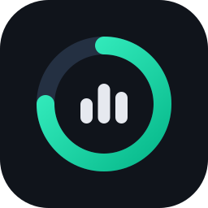

# AppTrackr

Foreground app usage tracker for Windows. Counts the time each app actually has focus,
shows it as a dashboard, calendar and per-app history, and stays out of the way in the tray.

[](https://github.com/H4ch1Net/AppTrackr/actions/workflows/ci.yml)
[](https://github.com/H4ch1Net/AppTrackr/releases/latest)


[](LICENSE)

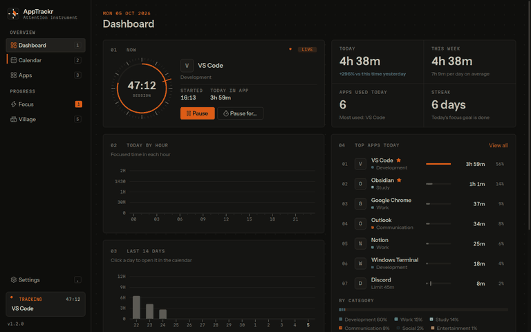

</div>

## Overview

Most "screen time" numbers measure how long a window was open. AppTrackr measures how long it was
in front of you: time is credited only to the focused app, stops when you go idle or lock the
screen, and is written to a local SQLite database every 30 seconds. Nothing leaves your machine.

On top of the raw numbers it adds the things you reach for next: a heatmap calendar, per-app
trends and sessions, daily limits with notifications, and an optional rewards layer that turns
time in chosen apps into XP and a small village-building game.

## Features

| Area | What you get |
| --- | --- |
| Tracking | Foreground-only time, idle cut-off at your last input, lock-screen detection, midnight-accurate daily totals, UWP apps resolved to the real app, elevated apps tracked by name |
| Dashboard | Live session card, today vs. this time yesterday, week total, today by hour, last 14 days, top apps with share and category breakdown |
| Calendar | Month heatmap with keyboard navigation, month totals and busiest day, per-day hourly chart and app list |
| Apps | Search, period filter (today to all time), category and favorite filters, sort by time, launches or clicks |
| App detail | Today / 7 / 30 day totals, 30-day chart, recent sessions, first and last seen, longest session, rename, category |
| Control | Per-app daily limits with notifications, exclude any app (with undo), pause from the tray for a set time |
| Rewards | Optional XP, levels, streaks and the Neon Village game with buildings that boost future rewards |
| Desktop | Tray icon with live tooltip, launch at sign-in (starts hidden), single instance, dark, light or system theme with 8 accents |
| Motion | Fluent-timed page transitions, counters, chart and list motion that explain each change; follows Windows *Animation effects* and can be turned off in Settings |
| Data | CSV and JSON export, consistent database backup and validated restore, automatic schema migrations |
| Updates | Once-a-day check against GitHub releases, in-app download and install |

## Screenshots

<table>
  <tr>
    <td width="50%">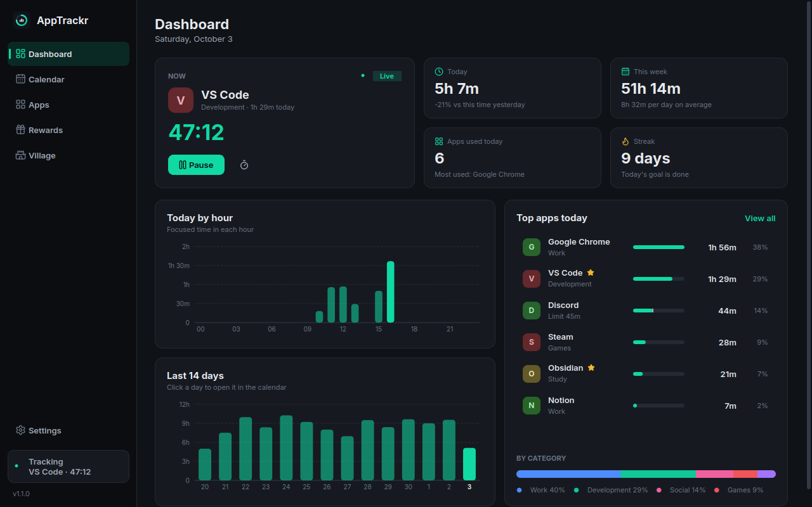<br><sub>Dashboard with the live session, today by hour and top apps</sub></td>
    <td width="50%">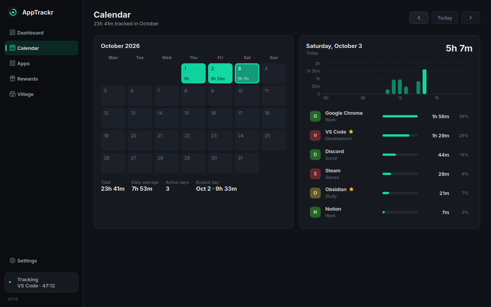<br><sub>Calendar heatmap with the selected day's breakdown</sub></td>
  </tr>
  <tr>
    <td>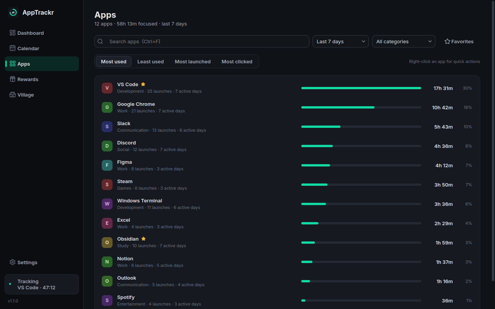<br><sub>All apps for a period, filterable and sortable</sub></td>
    <td>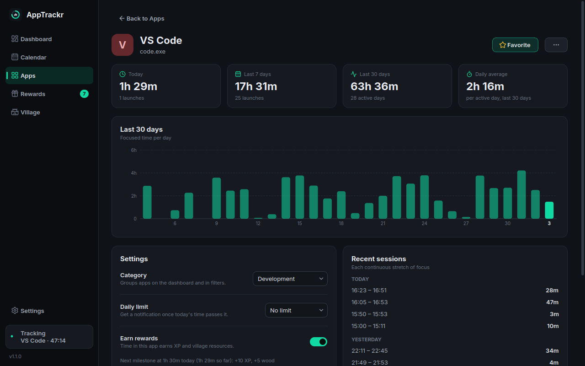<br><sub>Per-app history, limit, rewards and sessions</sub></td>
  </tr>
  <tr>
    <td>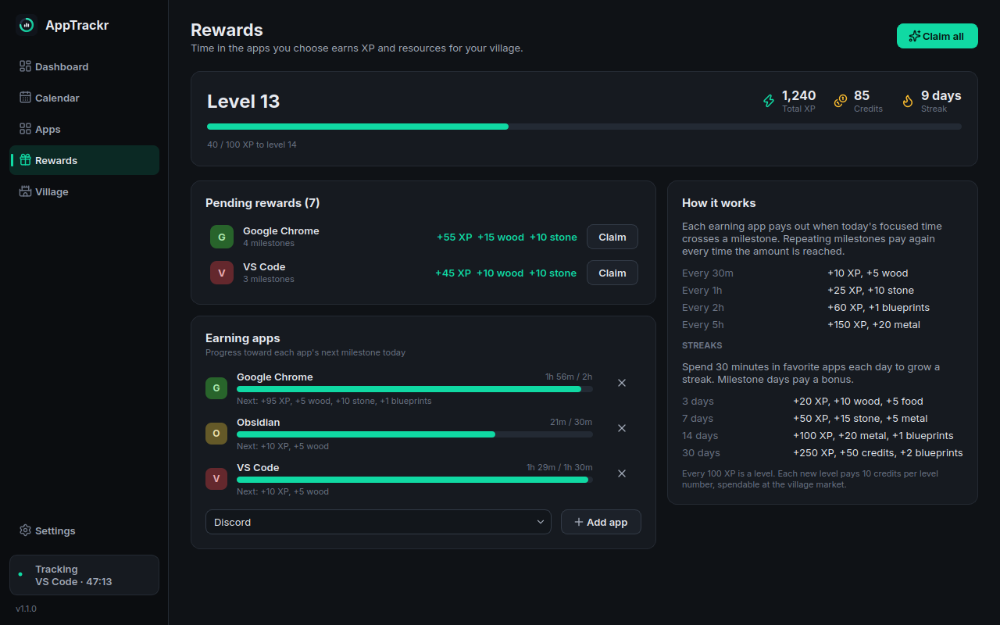<br><sub>Level progress, pending rewards and earning apps</sub></td>
    <td>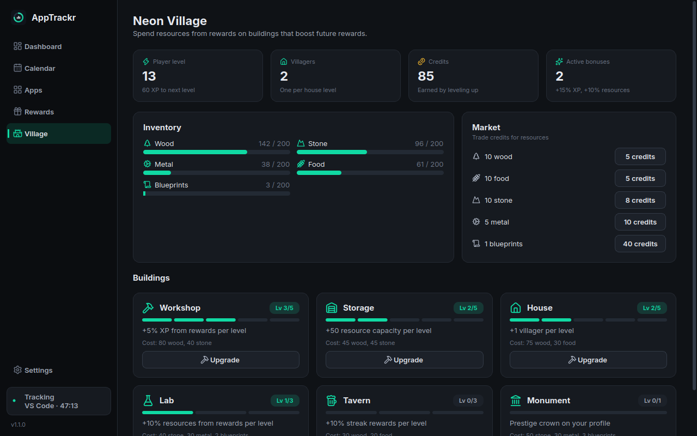<br><sub>Neon Village: buildings, inventory and market</sub></td>
  </tr>
  <tr>
    <td>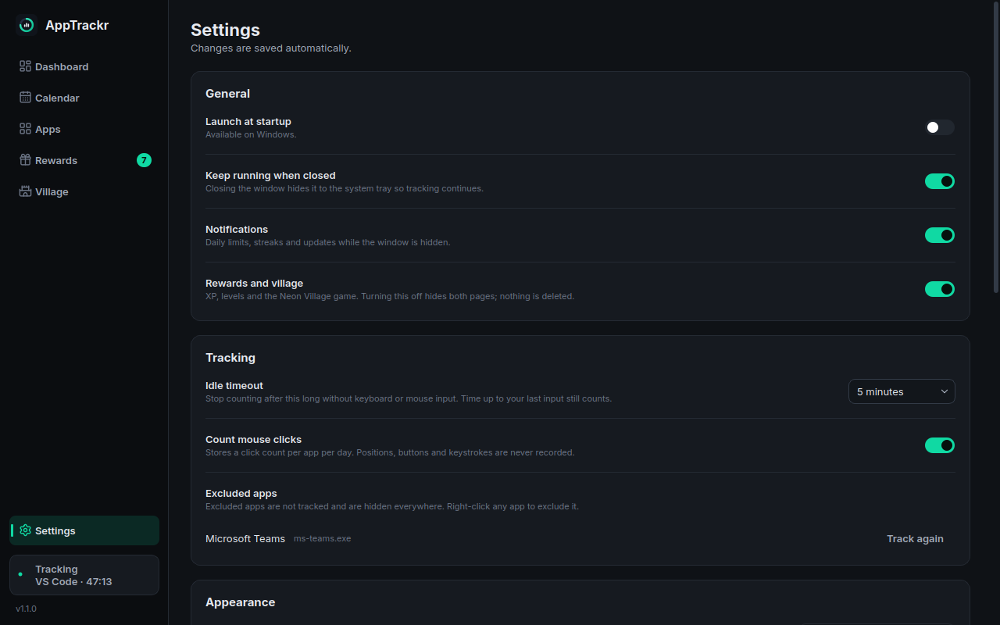<br><sub>Settings apply immediately</sub></td>
    <td>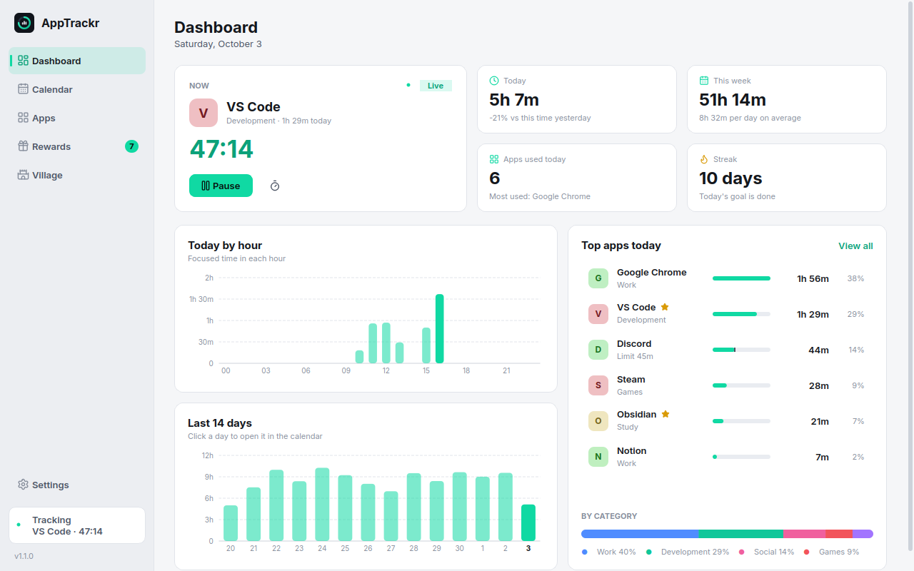<br><sub>Light theme</sub></td>
  </tr>
</table>

Screenshots and the animation above are generated from demo data with `python scripts/screenshots.py`
and `python scripts/record_demo.py`.

## Installation

Download the latest build from [Releases](https://github.com/H4ch1Net/AppTrackr/releases/latest).

| Package | Use it when |
| --- | --- |
| `AppTrackr_Setup.exe` | You want Start Menu entries, optional sign-in startup and uninstall support. Installs per user, no admin rights needed. |
| `AppTrackr_Portable.zip` | You want to run it from a folder. Extract anywhere and start `AppTrackr.exe`. |

Requirements: Windows 10 or 11 (64-bit). Upgrading over v1.0 keeps your data and migrates it on first start.

## Usage

AppTrackr starts tracking as soon as it runs. Closing the window keeps it running in the tray;
use **Quit** from the tray menu (or <kbd>Ctrl</kbd>+<kbd>Q</kbd>) to stop it.

- **Pause.** Click the status pill at the bottom of the sidebar, use the dashboard button, or pick
  *Pause for* in the tray menu to resume automatically after 15 minutes to 2 hours.
- **Daily limits.** Open an app and choose a limit. You get one notification per day when it is passed;
  the dashboard and charts mark the limit.
- **Exclude an app.** Right-click it in any list and choose *Exclude from tracking*. Manage exclusions in
  Settings.
- **Favorites and streaks.** Star apps you want to spend time in. A streak day needs 30 minutes in favorites.
- **Rewards.** Pick earning apps on the Rewards page or from an app's page. Milestones (30 min, 1 h, 2 h, 5 h
  of focus per day) pay XP and resources you spend in the village. Turn the whole layer off in Settings.

### Keyboard shortcuts

| Keys | Action |
| --- | --- |
| <kbd>Ctrl</kbd>+<kbd>1</kbd> to <kbd>Ctrl</kbd>+<kbd>5</kbd> | Dashboard, Calendar, Apps, Rewards, Village |
| <kbd>Ctrl</kbd>+<kbd>,</kbd> | Settings |
| <kbd>Ctrl</kbd>+<kbd>F</kbd> | Search apps |
| <kbd>Ctrl</kbd>+<kbd>Shift</kbd>+<kbd>P</kbd> | Pause or resume tracking |
| <kbd>Esc</kbd> / <kbd>Alt</kbd>+<kbd>Left</kbd> | Back from an app page |
| <kbd>Left</kbd> <kbd>Right</kbd> <kbd>Up</kbd> <kbd>Down</kbd>, <kbd>PgUp</kbd> <kbd>PgDn</kbd> | Move through days and months in the calendar |
| <kbd>F5</kbd> | Refresh the current page |

### Command line

```text
AppTrackr.exe [--minimized] [--demo] [--data-dir PATH] [--debug] [--version]
```

| Option | Effect |
| --- | --- |
| `--minimized` | Start hidden in the tray (used by the sign-in entry) |
| `--demo` | Use generated sample data in a temporary folder. Nothing real is read or recorded. |
| `--data-dir PATH` | Keep the database and logs in `PATH` |
| `--debug` | Verbose logging |

Starting AppTrackr while it is already running brings the existing window to the front.

### Motion

Animations use Fluent 2 timing (100 to 400 ms, decelerate curves for things that enter, easy-ease for
things that move) and only run in response to a change: a page opens, a filter changes, a value updates
or an item is removed. Background refreshes morph values in place instead of replaying entrances.
AppTrackr follows Windows' *Settings > Accessibility > Visual effects > Animation effects*; the
*Animations* switch under Settings > Appearance overrides it.

## Configuration

All settings live in the app and apply immediately. Storage locations and two environment
variables cover the rest.

| Item | Default |
| --- | --- |
| Database | `%APPDATA%\AppTrackr\data.sqlite` |
| Logs | `%APPDATA%\AppTrackr\logs\apptrackr.log` (rotated, 3 x 1 MB) |
| `APPTRACKR_DATA_DIR` | Overrides the data folder, same as `--data-dir` |
| `APPTRACKR_UPDATE_URL` | Alternative release feed (GitHub releases API URL) |

<details>
<summary>How time is counted</summary>

- The tracker samples the foreground window 4 times per second.
- Focus on the shell (desktop, taskbar, Start, lock screen) and on background helpers is not credited to any app.
- When there has been no input for the idle timeout (5 minutes by default), the session is closed at the
  moment of your last input, so idle time is never counted.
- Locking the screen closes the session the same way.
- Committed time is split at local midnight, so late sessions land on the right days.
- A *launch* is an app going from not running to running. Multi-process apps such as browsers count once.
- Click counting (off by default) stores only a number per app per day.

</details>

## Privacy

- Everything is stored locally in one SQLite file. There is no account, telemetry or cloud sync.
- Window titles, keystrokes and screen contents are never recorded.
- The only network request is the optional daily update check to `api.github.com`.

## Development

Requires Python 3.10 or newer. Tracking only works on Windows, but the UI, tests and demo mode run
anywhere PySide6 does.

```bash
git clone https://github.com/H4ch1Net/AppTrackr.git
cd AppTrackr
python -m venv .venv
.venv\Scripts\activate            # source .venv/bin/activate on Linux/macOS
pip install -e ".[dev]"

python -m apptrackr --demo        # explore with sample data
python -m apptrackr               # real tracking (Windows)
```

| Task | Command |
| --- | --- |
| Tests | `pytest` |
| Lint and format | `ruff check . && ruff format .` |
| Regenerate screenshots | `python scripts/screenshots.py` |
| Record the README animation | `python scripts/record_demo.py` |
| Rebuild the app icon | `python scripts/make_icon.py` |
| Build the app folder | `pyinstaller packaging/apptrackr.spec` |
| Build the installer | `iscc /DAppVersion=1.1.0 packaging\installer.iss` |

On headless Linux, Qt needs `libegl1` and `libxkbcommon0`, and tests run with `QT_QPA_PLATFORM=offscreen`
(set automatically by `tests/conftest.py`).

### Releasing

Bump `__version__` in `apptrackr/__init__.py`, then push a matching tag:

```bash
git tag v1.1.0
git push origin v1.1.0
```

`.github/workflows/release-windows.yml` checks that the tag matches the version, runs the tests, builds
the PyInstaller bundle, self-tests it, packages the portable zip and the Inno Setup installer, and attaches
both to the GitHub release. `ci.yml` runs lint and tests on Windows and Linux for every push and pull request.

### Project structure

```text
apptrackr/
  __main__.py        entry point: arguments, logging, single instance, service wiring
  paths.py           data, log and asset locations
  core/              tracker, platform (Win32), launch watcher, click counter, autostart, limits
  data/              SQLite access and migrations, queries, export/backup, app catalog, demo data
  rewards/           milestone rules, reward engine, streaks
  game/              village state and balance values
  updater/           GitHub release check and installer download
  ui/                main window, theme and motion tokens, icons, views and shared widgets
  assets/            logo and Lucide icons
packaging/           PyInstaller spec, Inno Setup script, app icon
scripts/             screenshot, demo animation and icon generators
tests/               pytest suite (data, tracker, rewards, updater, offscreen UI)
```

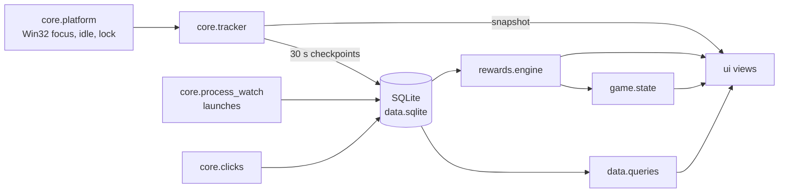

<details>
<summary>Troubleshooting</summary>

- **Nothing is tracked.** Check the status pill in the sidebar. *Paused* resumes on click. *Idle* means no
  input for the idle timeout. Apps you excluded are listed in Settings.
- **An app shows up under an odd name.** Open it and use the menu next to *Favorite* to rename it.
- **The window opens at sign-in instead of staying in the tray.** Startup entries created by v1.0 lack
  `--minimized`. Turn *Launch at startup* off and on again in Settings to rewrite the entry.
- **Something broke.** Run with `--debug` and look at `%APPDATA%\AppTrackr\logs\apptrackr.log`, then
  [open an issue](https://github.com/H4ch1Net/AppTrackr/issues) with the relevant lines.

</details>

## Contributing

Issues and pull requests are welcome. Keep changes focused, run `ruff check .`, `ruff format .` and `pytest`
before pushing, and add a test when you change tracking, data or reward logic. UI changes should come with
regenerated screenshots if they change what the README shows.

## License

[MIT](LICENSE). Icons from [Lucide](https://lucide.dev) (ISC, see `apptrackr/assets/icons/LICENSE`).
